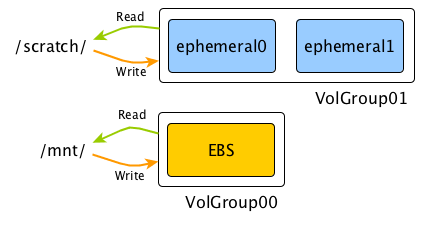
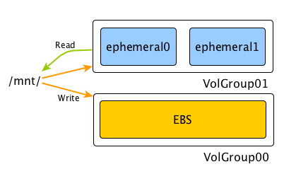

# GetBox

#### "playground" instance manager

In a nutshell:
* One-click launch ec2 spot instances and attach EBS volumes to them

* Instances and volumes will be properly tagged with your team and **your** name.

## Installation:

The only dependency is `boto3`, you probably already have it. If not you can install it using `pip install boto3` . After that do:

```
python getbox install
```

That will install the binary to `/usr/local/bin` and will try to install bash completions as well.

It also assumes you have ssh key pair used to access EC2 instances in your ssh agent.

You'll need AWS creds. If you have used awscli on your machine before, you should be good. If not, install awscli and run `aws configure`.

## Magic

Laziest way ever to get an instance in one command:

```console
$ getbox get
<..a minute later..>
[ubuntu@ip-172-18-142-171 ~]$
```

You get an ubuntu 17.04 linux box in `us-west-2`. It will have a 100GB EBS drive mounted at `/mnt`.

By default, EBS drive will be deleted when instance is terminated. You can change that behavior using `getbox keep` command or you can combine that `getbox get r3.4xlarge keep`. Remember that your spot instance can be terminated by Amazon at any time.

## Usage:

Since it will tag instances will your unix user name, don't run it as root or in a container.

```
                      Usage: getbox <cmd> [parameters]
get          Get an ec2 instance and ssh into it.                          getbox get r3.8xlarge
             ...optionally, pass EBS volume id to attach.                  getbox get vol-321
             ...or both                                                    getbox get r3.8xlarge vol-321
             ...you can also name it                                       getbox get r3.8xlarge --name mytestbox
             ...or specify EBS volume size                                 getbox get r3.8xlarge 200GB
list         List your instances and volumes                               getbox list
kill         Kill an instance or (unattached) volume                       getbox kill 123
                                                                           getbox kill vol-456
ssh          Log into the instance (uses utility1 key)                     getbox ssh 123
keep         Disable delete-on-termination on an attached EBS volume       getbox keep vol-123
unkeep       Enable delete-on-termination on an attached EBS volume        getbox unkeep vol-123
install      Install getbox to /usr/local/bin and add bash autocomplete    getbox install
```


`getbox ssh <instance-id>` is a bit magic; if used from interactive console, it will just log you in. But if it detects that its output was redirected, it will return user@host string. That allows you to use custom ssh flags or rsync/scp like this: `rsync -av . $(getbox ssh):`

Also, when starting an instance with an existing EBS drive using `getbox get vol-123141` if you don't specify instance type explicitly, `getbox` will automatically choose the instance type that was last used with that EBS volume.


## Instances with ephemeral drives

Ephemeral drives often provide much better performance in terms of iops and latency than EBS. With `getbox`, you have two options: either mount ephemeral drives as a separate "scratch" volume, or automatically mirror data both to EBS and ephemeral drives, so it survives instance termination.

##### 1. Use ephemeral drives as a scratch store


EBS will be mounted at `/mnt` and ephemeral drives will be mounted as one RAID-0 lvm voume under `/scratch`.  You will lose everything under `/scratch` when instance gets terminated.

##### 2. Use ephemeral drives as a mirror


In this mode, toggled by `--mirror` flag, `getbox` creates a RAID volume so that all writes go **both** to ephemeral drives as well as EBS volume. It is set up so that reads only go to the ephemeral drive when possible, so you get random read performance closest to that of the ephemeral drive and write performance of the slowest of two, and you don't lose the data when instance terminates.

You get both the (read) performance and persistence!

There are a couple caveats:

* You cannot choose EBS volume size in this mode; it will be automatically choosen to match ephemeral storage, depending on your instance type.
* Currently you can only reuse mirrored EBS volume with the same instance type (since ephemeral drives size has to match EBS size).  `getbox` remembers what instance type was used, so you can just run `getbox get <volume-id>` and it will start an instance of the same type and will reassemble RAID array.
* When first launching the instance in this mode, it will require 10-50 minutes to resync the RAID array; you can use the instance during resync, but read performance will be that of EBS. You can check status of resync by using `mdadm --detail /dev/md0`.
* Remember that you still need to do `getbox keep` to keep the EBS drive around when instance terminates.


## Configuration

You can customize some of `getbox` default parameters using JSON config file in your home dir named `.getbox`.

| Name          | Description   | Default |
| ------------- |---------------|--------|
| `extra_tags`    | Tags to assign to ec2 instance and EBS drive | |
| `owner_tag_name` | `getbox` also tags your instances with your username, this is the name of the tag | `"owner"` |
| `ssh_user` | Linux username used to ssh into instances      |    `"ubuntu"` |
| `ssh_key_name` | Name of ssh keypair to use when creating an instance      |    `"utility1"` |
| `ssh_wait_timeout_seconds` | Timeout when trying to connect to a newly created instance      |    `600` |
| `ssh_flags` | Flags to use with ssh command for `getbox ssh`      |    `"-A"` |
| `root_size_gb` | Default size of the root EBS drive (GiB)      |    `30` |
| `ami_id` | EC2 AMI id to use      |    `"ami-790ec601"` |
| `cuda_ami_id` | EC2 AMI id to use with GPU-enabled instances (can be null, then `ami_id` is used)      |    `"ami-a1e534d9"` |
| `iam_role_arn` | EC2 IAM role arn to use for instance profile      |     |
| `security_groups` | A list of security group ids to use      |    |
| `subnets` | A list of subnets to use      |   |
| `spot_price` | Spot price | `"3.00"`
